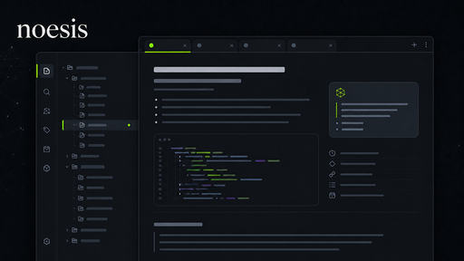

# noesis

noesis is a cohesive Obsidian theme for technical notes, research, task lists, Codeboxes, callouts, and long-form writing. It includes the complete feature set: the Hack The Box (HTB) visual preset, technical callouts for operations and security, and every Codebox palette.

Designed by k2ak3n.



## What it does

- Provides coordinated Default and HTB visual presets with light and dark mode support.
- Styles main tabs, sidebar tabs, stacked tabs, ribbon icons, file explorer items, and side panes as one visual system.
- Uses Pristine light surfaces and Neutral Graphite dark surfaces by default.
- Adds selectable syntax palettes and contrast levels for Codeboxes.
- Includes technical callouts for documentation, operations, security assessment, timelines, and attack chains.
- Styles task priority markers such as `[!]`, `[H]`, `[M]`, and `[L]`.
- Polishes Properties, tags, search, backlinks, outgoing links, graph, canvas, dialogs, and print/PDF output.
- Works offline without remote images, fonts, or internet-dependent assets.

## Install manually

Create this folder in your vault:

```text
.obsidian/themes/noesis/
```

Copy these files from `dist/noesis/` into it:

```text
manifest.json
theme.css
README.md
```

Then select **noesis** in Obsidian's Appearance settings.

## Style Settings

noesis works without extras, and its defaults use the standard noesis visual preset. The optional **Style Settings** community plugin adds controls for:

- Visual presets, headings, sidebars, and tabs
- Density, reading layouts, and print/PDF output
- Syntax palettes and code contrast
- Callouts, task markers, tables, graph, canvas, dialogs, and overlays

## Callouts

noesis styles Obsidian's built-in callouts and adds the custom callouts below. Invoke one with `> [!code]`, for example:

```md
> [!decision] Use a versioned migration plan
> The change is approved for the next release.
```

| Invocation | Use it for |
| --- | --- |
| `> [!decision]` | A decision, trade-off, or approval. |
| `> [!definition]` | A term or concept definition. |
| `> [!artifact]` | A deliverable, file, or other project artifact. |
| `> [!scope]` | In-scope work, boundaries, or exclusions. |
| `> [!recon]` | Reconnaissance notes and discovery work. |
| `> [!target]` | A system, host, service, or other assessment target. |
| `> [!attack-path]` | A potential route through an attack surface. |
| `> [!finding]` | An observed issue or assessment finding. |
| `> [!vulnerability]` | A confirmed vulnerability and its impact. |
| `> [!exploit]` | Exploit steps, proof of concept, or execution notes. |
| `> [!credential]` | Credential-handling notes or access details. |
| `> [!remediation]` | A fix, mitigation, or hardening action. |
| `> [!report]` | A report-ready summary or evidence. |
| `> [!network]` | Network topology, service, or connectivity notes. |
| `> [!maintenance]` | Scheduled upkeep, change, or operational work. |
| `> [!rollback]` | A rollback plan or reversal procedure. |
| `> [!security]` | A security control, status, or verification note. |
| `> [!automation]` | An automated workflow, script, or bot action. |
| `> [!timeline]` | A chronological sequence; use headings to create milestones. |
| `> [!attackchain]` | A staged attack sequence; use level-three headings for numbered steps. |

## Task markers

noesis distinguishes priority markers in editing and reading views:

```text
- [!] Critical task
- [H] High task
- [M] Medium task
- [L] Low task
- [ ] Normal task
- [x] Completed task
```

## Development

Use Node 20 or newer. Install the locked dependencies:

```text
npm ci
```

Build the distributable theme:

```text
npm run build
```

The build writes the installable artifact to `dist/noesis/` and mirrors its stylesheet to root `theme.css` for local development.

Run the full build and static guardrails:

```text
npm test
```

`npm test` verifies the generated artifact, all Style Settings selectors, contrast smoke checks, selector complexity, and the release theme card. Use [visual-qa.md](visual-qa.md) before a release.

## Publishing

Keep a `screenshot.png` theme card in the repository root. It must be a 512 × 288 PNG; the release checks validate its format and dimensions. This repository uses an original UI-inspired noesis theme card for the community-directory thumbnail.

Commit the release, then create and push a semantic-version tag matching both `manifest.json` and `package.json`—for this release, `1.0.0`:

```text
git tag 1.0.0
git push origin 1.0.0
```

The **Quality checks** workflow verifies pull requests and pushes to `main`. The **Release theme** workflow validates the tag, build, license, and root screenshot; it then creates a GitHub Release containing `manifest.json` and `theme.css`.

After the release completes, submit this repository through **Themes → New theme** at [Obsidian Community](https://community.obsidian.md). The directory checks the default-branch manifest and installs the GitHub Release whose tag matches its version.

## License

noesis is licensed under the [MIT License](LICENSE).
